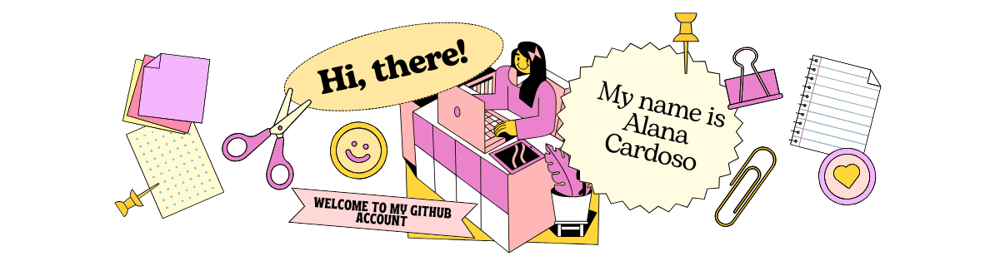

  

  

    <strong>Project Manager & Mobile Software Engineer</strong> 
    Expert in Native Android (Kotlin/Java) & React Native | Specialized in Smart TV Deployment  

---

### About Me
- 🎓 **Software Engineering Graduate** from UniBrasil.
- 💼 **Project Manager:** Leading agile development teams and managing Sprints, Epics, and roadmaps via Jira.
- 📱 **Mobile Expert:** Extensive experience in Native Android (Kotlin, Java, and Jetpack Compose) as well as React Native.
- 🚀 **Store Publishing:** Experienced in the end-to-end publishing process for both Google Play Store and Apple App Store.
- 🍎 **iOS Learner:** Currently expanding my technical stack by studying iOS Development with Swift and SwiftUI.
- 📺 **TV Deployment:** Currently specializing in the publishing process for Smart TV platforms, including Samsung (Tizen), Titan OS, Philips, and AOC.
---

### Technologies & Tools

#### Development Stack

#### Management & Workspace

---

### 📫 Connect with me:

 
  
  
   

